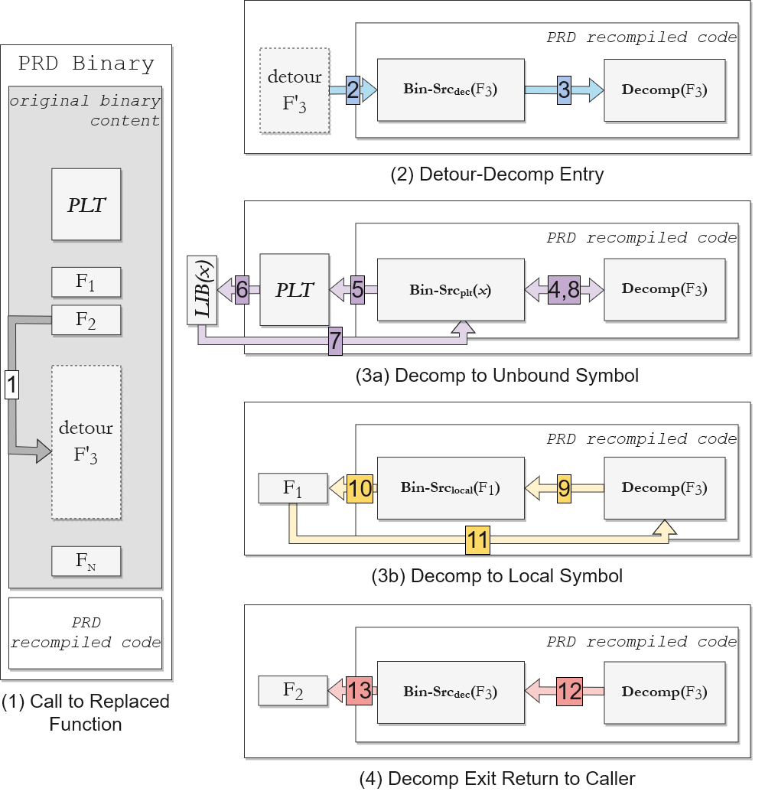
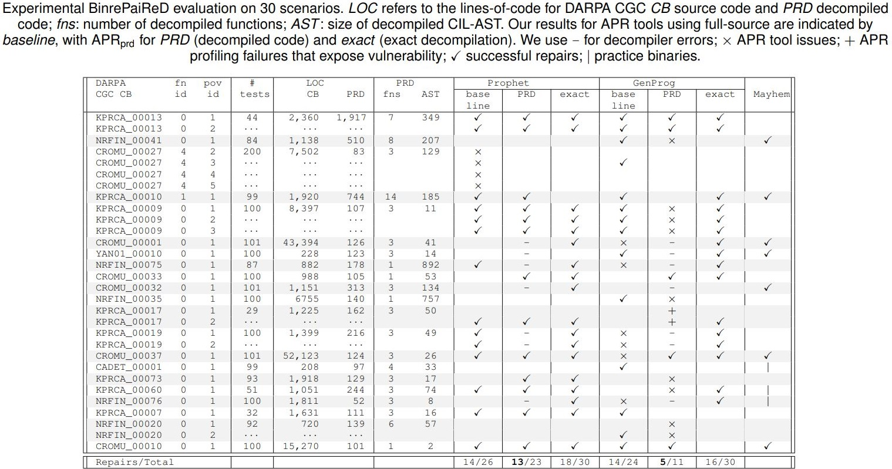

# FuncRepair
function-based PRD (Partial Recompilation and Binary Rewriting) scripts for use with BinREPARED (a binary Automated Program Repair Framework)

For PRD decompilation support, see git submodule `partial_decompilation`

## Pre-requisite tools
* IDA - this is a proprietary decompiler, please link your ida decompiler to this directory: i.e. ln -sf \$IDADIR ida
* R - this is used for Coarse-Grained Fault Localization (CGFL), which re-implements RAFL (Motwani, 2020 [https://arxiv.org/abs/2011.08340]) using RankAggregation (merges 5 standard SBFL metrics into a single list)
  * Goto https://cran.r-project.org/ for installation information
* Other tools are installed by our initialization and set up script, `init.bash`

## How to set up
`source init.bash` 
* This sets up a python virtual environment that ensures that both the Python2 and Python3 requirements for the cb-multios (Linux) version of the DARPA CGC Challenge Binaries are installed
  * python3-ported versions of cb-multios scripts are located at:
  	* tools/cb-multios
* This clones/downloads ancillary repos/tarballs and prepares them for use with BinREPARED
  * glibc 2.31 source (reference content)
  * dietlibc (lightweight libc alternative)
  * cb-multios
  * R packages: RankAggreg, gtools [IFF R is installed]
  * APR
  	* GenProg for BinREPARED 
		* available as git submodule
  	* Prophet for BinREPARED
		* requires manual updates to official tar.gz image
		* see tools/apr/prophet/README.md
		* all provided scripts were tested with PRD with cb-multios

## Our approach to binary repair

Our approach centers on the idea that for most (if not all) binary programs, partial analysis is sufficient for binary repair. The following insights guided PRD: 
1. fault localization can identify a small set of functions relevant to the vulnerability;
2. decompilers can lift a small set of functions and compatible types to recompilable source code;
3. binary-source interfaces and binary rewriting can transform them into test-equivalent binaries, even when tools fail for full binaries;
4. the set of decompiled binary functions provide sufficient context to enable source-level analyses and transformations, even when those methods
only operate on source.

We consider PRD a novel approach to automating binary repair that reduces the technical burden of binary repair and enables more human-centered analyses, by leveraging higher level source code as its binary repair content.

Our prototype focuses on x86, System-V ABI.

### Technical impact of source-level binary patching
Source-level binary patching poses additional requirements, as well as analytical and engineering difficulties. Specifically, PRD must ensure that all resulting binaries retain the same executional qualities as the original, such as the ability to call and use symbols regardless of their binding state. Binary-source interfaces allow decompiled code to execute original binary code, and, by using customized detours, original binary code to execute decompiled code. Although it does not recompile the original source code, PRD does compile the source code it generates, i.e., decompiled functions and binary-source interfaces (PRD decompiled code). Since compilers do not support combining new content with non-object binary content, PRD must effectively perform linking and locating with all new content, as well as translate function callees, each accomplished through binary rewriting.

#### PRD Execution Flows
Here, we depict high-level execution flows between original binary content and repair content as enabled by PRD.

While these flows outline interaction between binary components, we give examples for these interfaces in the next subsection.

#### Example automatically generated binary-source interfaces
The following is an example of automatically generated binary-source interfaces for a CGC CB function `cgc_read_line` and its required symbols.
We note that, although the decompiler-definition has been omitted, `cgc_read_line`'s prototype is declared. 

* Example Unbound Symbol interface (`Bin-Src(plt)`)
```c
// Bin-Src(plt) : PLT register
unsigned int origPLT_EBX = NULL;

// Bin-Src(plt) : typedef function ptr 
typedef int (*pcgc_receive)(int s_0, int s_1, int s_2, int s_3);
pcgc_receive z__cgc_receive = NULL; 

// Bin-Src(plt) : Unbound Symbol interface 
int cgc_receive (int s_0,int s_1,int s_2,int s_3) {
    pcgc_receive lcgc_receive = z__cgc_receive;
    int ret;
    unsigned int localEBX;
    unsigned int localorigPLT_EBX = origPLT_EBX;
    asm ( "movl %[LOCALEBX],%%ebx\n\t"
          "movl %%ebx,%[PLT_EBX]\n\t"
          :[LOCALEBX] "=r"(localEBX)
          :[PLT_EBX] "r"(localorigPLT_EBX)
          : "%ebx");
    ret = lcgc_receive(s_0,s_1,s_2,s_3);
    asm ( "movl %%ebx,%[LOCALEBX]\n\t"
          :[LOCALEBX]"=r"(localEBX));
    return ret;
}
```
* Example Local Symbol interface (`Bin-Src(local)`)
```c
// Bin-Src(local) : typedef function ptr
typedef void * (*pcgc_memcpy)(void *, const void *, cgc_size_t);
pcgc_memcpy cgc_memcpy = NULL;

// Bin-Src(local) : typedef function ptr
typedef void * (*pcgc_calloc)(cgc_size_t);
pcgc_calloc cgc_calloc = NULL;
```
* Example Detour interface (`Bin-Src(dec)`) and Decompiled function prototype (`Decomp`)
```c
// Decomp : Decompiled Function Declaration
cgc_ssize_t  cgc_read_line(int fd, char **buf);

// Bin-Src(dec) : Detour Interface 
cgc_ssize_t  det_cgc_read_line( 
    // binary-source interface references
    void* EBX, void* mycgc_receive, void* mycgc_calloc, void* mycgc_memcpy,
    // parameters from Decompiled Function
    int fd, char * * buf )
{
    cgc_ssize_t retValue;
    origPLT_EBX = (unsigned int) EBX;
    z__cgc_receive = (pcgc_receive)(mycgc_receive);
    cgc_calloc = (pcgc_calloc)(mycgc_calloc);
    cgc_memcpy = (pcgc_memcpy)(mycgc_memcpy);

    retValue = cgc_read_line( fd, buf);
    asm( "mov    -0xc(%ebp),%eax\n\t"
         "mov    -0x4(%ebp),%ebx\n\t" "nop\n\t"
         "add    $0x14,%esp\n\t" "nop\n\t"
         "pop %ebx\n\t"
         "pop %ebp\n\t"
         "pop %ecx\n\t"
         "add $0xc,%esp\n\t"
         "push %ecx\n\t"
         "ret\n\t" 
    ); /* stack-correcting inline assembly */
    return retValue;
}
```

## Evaluation Results

### Impact of Decompilation
Without any grammar or type restrictions, we evaluated baseline assumptions of decompiler quality, specifically looking at the following research questions
* RQ1. Without any restrictions, how often is decompiled code recompilable?
* RQ2. Is decompiled code behaviorally consistent to original binary functions?


* In the preceding table, we see that 11-57% of functions are impacted by decompiler issues even before evaluating semantics.  
These results reiterate the need for partial analyses, while decompiler tools are imperfect. (RQ1)
* We also see that, when decompilation succeeds, PRD largely generates test-equivalent binaries.

### Application to Automated Binary Repair using source-level APR algorithms
In this table, we outline our BinrePaiReD results for 30 DARPA Cyber Grand Challenge Binaries

